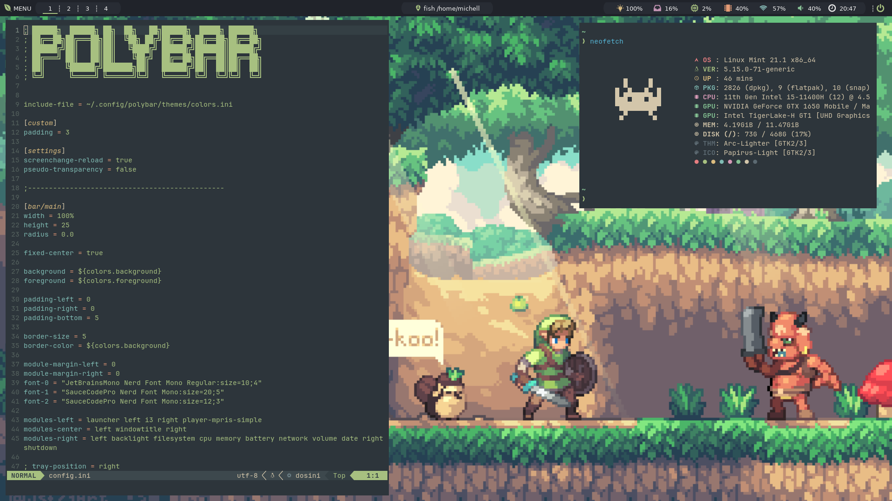

<p align="center">
  <a href="https://github.com/mstuttgart/dotfiles/">
    
  </a>
</p>

<p align="center">
  <a href="#about">About</a> |
  <a href="#install">Install</a> |
  <a href="#credits">Credits</a>
</p>

## About



This repository serves as my way to help me setup and maintain my Ubuntu (version 22.04 LTS).

Here are some details about my setup:

- **Linux Distribution**           : [Linux Mint](https://www.linuxmint.com/)
- **Window Manager**               : [i3](https://github.com/i3/i3)
- **Shell**                        : [fish](https://fishshell.com/) with [tide](https://github.com/IlanCosman/tide) theme plugin!
- **Terminal**                     : [kitty](https://github.com/kovidgoyal/kitty)
- **Bar**                        : [polybar](https://github.com/polybar/polybar) using [nerd fonts](https://github.com/ryanoasis/nerd-fonts)!
- **Compositor**                   : [compton](https://github.com/chjj/compton)
- **Notify Daemon**                : [dunst](https://wiki.archlinux.org/index.php/Dunst)
- **Application Launcher**         : [rofi](https://github.com/davatorium/rofi)
- **File Manager**                 : [ranger](https://github.com/ranger/ranger)
- **Wallpaper Manager**            : [nitrogen](https://github.com/l3ib/nitrogen)
- **Editor**                       : [neovim](https://neovim.io/)
- **CLI System Information**       : [neofetch](https://github.com/dylanaraps/neofetch)

### Neovim Setup

Requires [Neovim](https://neovim.io/) (>= 0.8)

- [wbthomason/packer.nvim](https://github.com/wbthomason/packer.nvim) - A plugin manager for Neovim
- [hrsh7th/nvim-cmp](https://github.com/hrsh7th/nvim-cmp) - A completion engine plugin for neovim written in Lua
- [hrsh7th/cmp-nvim-lsp](https://github.com/hrsh7th/cmp-nvim-lsp) - nvim-cmp source for neovim's built-in LSP
- [hrsh7th/cmp-buffer](https://github.com/hrsh7th/cmp-buffer) - nvim-cmp source for buffer words
- [neovim/nvim-lspconfig](https://github.com/neovim/nvim-lspconfig) - A collection of configurations for Neovim's built-in LSP
- [williamboman/mason.nvim](https://github.com/williamboman/mason.nvim) - Portable package manager for Neovim that runs everywhere Neovim runs.
- [williamboman/mason-lspconfig.nvim](https://github.com/williamboman/mason-lspconfig.nvim) - Extension to mason.nvim that makes it easier to use lspconfig
- [L3MON4D3/LuaSnip](https://github.com/L3MON4D3/LuaSnip) - Snippet Engine for Neovim written in Lua
- [nvim-treesitter/nvim-treesitter](https://github.com/nvim-treesitter/nvim-treesitter) - [Treesitter](https://github.com/tree-sitter/tree-sitter) configurations and abstraction layer for Neovim
- [lewis6991/gitsigns.nvim](https://github.com/lewis6991/gitsigns.nvim) - Git integration for buffers
- [lukas-reineke/indent-blankline.nvim](https://github.com/lukas-reineke/indent-blankline.nvim) - Indent guides for Neovim
- [norcalli/nvim-colorizer.lua](https://github.com/norcalli/nvim-colorizer.lua) - A high-performance color highlighter
- [windwp/nvim-autopairs](https://github.com/windwp/nvim-autopairs) - Autopairs
- [nvim-telescope/telescope.nvim](https://github.com/nvim-telescope/telescope.nvim) - A highly extendable fuzzy finder over lists
- [nvim-telescope/telescope-fzf-native.vim](https://github.com/nvim-telescope/telescope-fzf-native.nvim) -  FZF sorter for telescope written in c
- [neanias/everforest-nvim](https://github.com/neanias/everforest-nvim) - A Lua port of the Everforest colour scheme
- [nvim-lualine/lualine.nvim](https://github.com/nvim-lualine/lualine.nvim) - A blazing fast and easy to configure Neovim statusline written in Lua
- [nvim-tree/nvim-tree.lua](https://github.com/nvim-tree/nvim-tree.lua)
- [kyazdani42/nvim-web-devicons](https://github.com/kyazdani42/nvim-web-devicons) - Lua `fork` of vim-web-devicons for neovim
- [windwp/nvim-autopairs](https://github.com/windwp/nvim-autopairs) - autopairs for neovim written by lua
- [iamcco/markdown-preview.nvim](https://github.com/iamcco/markdown-preview.nvim) - Markdown live preview
- [karb94/neoscroll.nvim](https://github.com/karb94/neoscroll.nvim) - Smooth scrolling neovim plugin written in lua
- [simrat39/symbols-outline.nvim](https://github.com/simrat39/symbols-outline.nvim) - A tree like view for symbols in Neovim using the Language Server Protocol
- [SmiteshP/nvim-navic](https://github.com/SmiteshP/nvim-navic) - Simple winbar/statusline plugin that shows your current code context
- [utilyre/barbecue.nvim](https://github.com/utilyre/barbecue.nvim) - A VS Code like winbar for Neovim
- [rcarriga/nvim-notify](https://github.com/rcarriga/nvim-notify) - https://github.com/rcarriga/nvim-notify
- [windwp/nvim-ts-autotag](https://github.com/windwp/nvim-ts-autotag) - Use treesitter to auto close and auto rename html tag
- [echasnovski/mini.comment](https://github.com/echasnovski/mini.comment) - Neovim Lua plugin for fast and familiar per-line commenting. Part of 'mini.nvim' library

### Shell Setup

- [Fish shell](https://fishshell.com/)
- [Fisher](https://github.com/jorgebucaran/fisher) - Plugin manager
    - [z](https://github.com/jethrokuan/z) - Directory jumping
    - [autopair](https://github.com/jorgebucaran/autopair.fish) -  Auto-complete matching pairs in the Fish command line
    - [fzf](https://github.com/PatrickF1/fzf.fish) - Fzf plugin for Fish
    - [asdf](https://github.com/rstacruz/fish-asdf) - Fish shell integrations for asdf version manager
- [Starship](https://starship.rs/) - Shell theme. The minimal, blazing-fast, and infinitely customizable prompt for any shell!
- [exa](https://the.exa.website/) - `ls` replacement
- [bat](https://github.com/sharkdp/bat) - A `cat`(1) clone with wings
- [btop](https://github.com/aristocratos/btop) - A monitor of resources
- [tig](https://github.com/jonas/tig) - Text-mode interface for git
- [Nerd Fonts](https://github.com/ryanoasis/nerd-fonts) - I use JetBrains and Sauce Code Pro (icons of Polybar)

## Install

> **Warning**: Settings applied by this repository are very personal, and definitely not suite everyones needs. Don’t blindly use my settings unless you know what that entails. Use at your own risk!

My dotfiles is managed by [yadm](https://yadm.io), a dotfiles manager. This makes it simple to set up a new computer and keep updates my config files. I order to set up a new system with these dotfiles, do the following:

### Debian/Ubuntu

```sh
$ apt install yadm
```

To others systems install instructions, see [here](https://yadm.io/docs/install).

### Set up

Use `yadm` to clone this repo and set up your enviromnent.

```sh
yadm clone git@github.com:mstuttgart/dotfiles.git
```

The `clone` and `pull` command may result in warnings because of pre-existing dotfiles. Overwrite the existing files with commands below.

```sh
yadm fetch --all
yadm reset --hard origin/main
```

## Credits

Copyright (C) 2019-2023 by Michell Stuttgart
