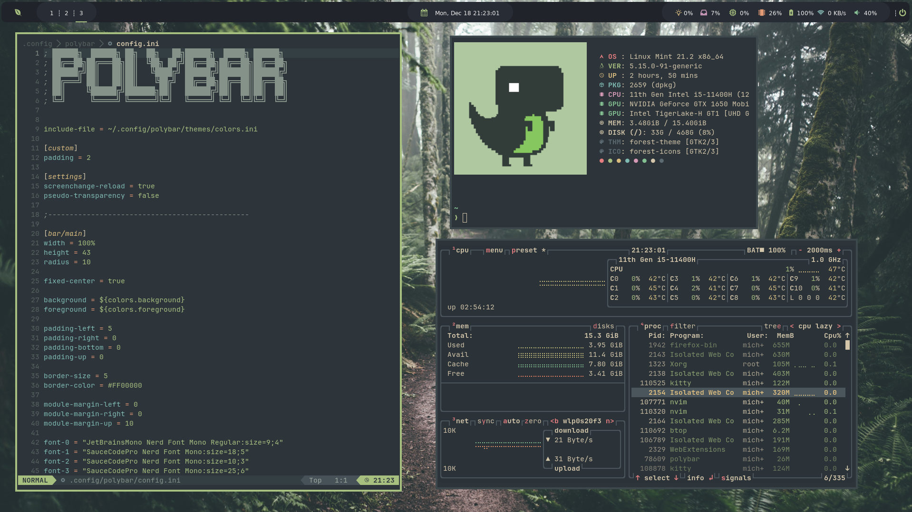

<p align="center">
  <a href="https://github.com/mstuttgart/dotfiles/">
    
  </a>
</p>

<p align="center">
  <a href="#about">About</a> |
  <a href="#install">Install</a> |
  <a href="#credits">Credits</a>
</p>

## About



This repository serves as my way to help me setup and maintain my Ubuntu (version 22.04 LTS).

Here are some details about my setup:

- **Linux Distribution**           : [Linux Mint](https://www.linuxmint.com/)
- **Window Manager**               : [i3](https://github.com/i3/i3)
- **Shell**                        : [fish](https://fishshell.com/) with [tide](https://github.com/IlanCosman/tide) theme plugin!
- **Terminal**                     : [kitty](https://github.com/kovidgoyal/kitty)
- **Bar**                        : [polybar](https://github.com/polybar/polybar) using [nerd fonts](https://github.com/ryanoasis/nerd-fonts)!
- **Compositor**                   : [compton](https://github.com/chjj/compton)
- **Notify Daemon**                : [dunst](https://wiki.archlinux.org/index.php/Dunst)
- **Application Launcher**         : [rofi](https://github.com/davatorium/rofi)
- **Wallpaper Manager**            : [nitrogen](https://github.com/l3ib/nitrogen)
- **Editor**                       : [neovim](https://neovim.io/)
- **CLI System Information**       : [neofetch](https://github.com/dylanaraps/neofetch)

### Shell Setup

- [Fish shell](https://fishshell.com/)
- [Fisher](https://github.com/jorgebucaran/fisher) - Plugin manager
    - [z](https://github.com/jethrokuan/z) - Directory jumping
    - [autopair](https://github.com/jorgebucaran/autopair.fish) -  Auto-complete matching pairs in the Fish command line
    - [fzf](https://github.com/PatrickF1/fzf.fish) - Fzf plugin for Fish
    - [gills](https://github.com/small-tech/gills) - adds an empty line after your prompt and before the output
- [Starship](https://starship.rs/) - Shell theme. The minimal, blazing-fast, and infinitely customizable prompt for any shell!
- [eza](https://github.com/eza-community/eza) - A modern, maintained replacement for `ls`
- [btop](https://github.com/aristocratos/btop) - A monitor of resources
- [tig](https://github.com/jonas/tig) - Text-mode interface for git
- [Nerd Fonts](https://github.com/ryanoasis/nerd-fonts) - I use JetBrains and Sauce Code Pro (icons of Polybar)

## Install

> **Warning**: Settings applied by this repository are very personal, and definitely not suite everyones needs. Don’t blindly use my settings unless you know what that entails. Use at your own risk!

My dotfiles is managed by [yadm](https://yadm.io), a dotfiles manager. This makes it simple to set up a new computer and keep updates my config files. I order to set up a new system with these dotfiles, do the following:

### Debian/Ubuntu

```sh
$ apt install yadm git
```

To others systems install instructions, see [here](https://yadm.io/docs/install).

### Set up

Use `yadm` to clone this repo and set up your enviromnent.

```sh
yadm clone git@github.com:mstuttgart/dotfiles.git
```

The `clone` and `pull` command may result in warnings because of pre-existing dotfiles. Overwrite the existing files with commands below.

```sh
yadm fetch --all
yadm reset --hard origin/main
```

## Credits

Copyright (C) 2019-2023 by Michell Stuttgart
